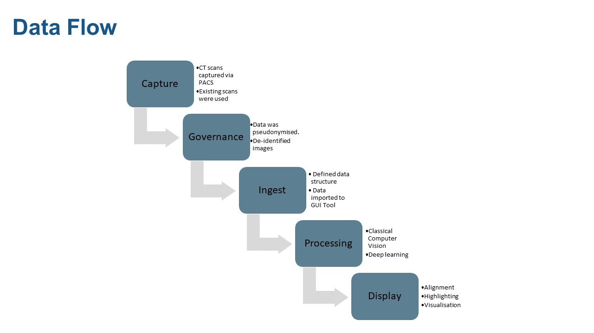

[](LICENSE)

[](https://github.com/GIScience/badges#experimental)

<!-- Add in additional badges as appropriate -->


# NHS AI Lab Skunkworks project: CT Alignment and Lesion Detection

> A pilot project for the NHS AI (Artificial Intelligence) Lab Skunkworks team, CT Alignment and Lesion detection uses a range of classical and machine learning computer vision techniques to align and detect lesions in anomyised CT scans over time from George Eliot Hospital NHS Trust.

As the successful candidate from the AI Skunkworks problem-sourcing programme, CT Alignment and Lesion Detection was first picked as a pilot project for the AI Skunkworks team in April 2021.

## Intended Purpose

This proof of concept ([TRL 4](https://en.wikipedia.org/wiki/Technology_readiness_level)) is intended to demonstrate the technical validity of applying phase correlation, coherent point detection and deep learning techniques to CT scans in order to align multiple scans and detect lesions. It is not intended for deployment in a clinical or non-clinical setting without further development and compliance with the [UK Medical Device Regulations 2002](https://www.legislation.gov.uk/uksi/2002/618/contents/made) where the product qualifies as a medical device.

![Screenshot of tool using CPD to align two CT scans using publicly available data from [tcia]](docs/ct-tool-cpd.png)


## Data Protection

This project was subject to a Data Protection Impact Assessment (DPIA), ensuring the protection of the data used in line with the [UK Data Protection Act 2018](https://www.legislation.gov.uk/ukpga/2018/12/contents/enacted) and [UK GDPR](https://ico.org.uk/for-organisations/dp-at-the-end-of-the-transition-period/data-protection-and-the-eu-in-detail/the-uk-gdpr/). No data or trained models are shared in this repository.

Example data shown in screenshots or video demonstrations are sourced from the [National Cancer Institute Clinical Proteomic Tumor Analysis Consortium (CPTAC). (2018). Radiology Data from the Clinical Proteomic Tumor Analysis Consortium Uterine Corpus Endometrial Carcinoma [CPTAC-UCEC] Collection [Data set]. The Cancer Imaging Archive][tcia] in line with the [TCIA Data Usage Policies and Restrictions](https://wiki.cancerimagingarchive.net/display/Public/Data+Usage+Policies+and+Restrictions).

## Background

This 12 week research project has focussed on how to identify features in a CT scan and automatically align their scan "slices" to enable early detection, diagnosis and, later, the treatment of lesions (tissue growth).

Comparing CT scans is a labour-intensive task. Currently there are no satisfactory automation tools that can speed up the process. Difficulties in aligning scans 100% accurately make it hard for radiologists to accurately measure changes.

The project aims to support radiologists by comparing two CT scans taken at different dates, to see if a patient has improved or deteriorated.

The project explores how AI might identify organs and lesions, report the change in size, and highlight areas of concern to the radiologist and how algorithms could be developed to attempt alignment of images to assess the volume of a lesion in 3D.

### Model selection

This project broadly followed two major strands: the alignment of scans, and the detection and measuring of anomalies within each scan.

For alignment, many computer vision techniques exist to align two visually similar images, and we aimed to trial several during the project. Phase correlation is an image registration method that can detect shifts well, but not other affine transformations. As patients are guided into roughly the same orientation upon entering a scanner, and the scale at which the scan is taken is recorded, phase correlation was expected to be viable for alignment. To address non-rigid transformation requirements, keypoint-based methods in 2D and coherent point drift in 3D were both proposed.

As the dataset was unlabelled, deep learning methods were restricted to unsupervised or self-supervised methods. A masked data prediction model was proposed and built for generalised anomaly detection, and Facebook Research's open source DINO method was used to train vision transformer models for tissue segmentation.

Classical machine learning and computer vision approaches were also used for tissue segmentation and anomaly detection. Textons with an extension of the Mean Shift clustering algorithm were used for a fast, explainable approach to tissue sectioning, and 3D ellipsdoid detection was used for locating regions of interest within CT scans, under the assumption that many lesions present as ellipsoids.

## Known Limitations

GUI Demonstration Tool:
* The demonstration tool and models have been built using CT scans with contrast generated on Siemens CT scanners with slice thickness between 1 and 5mm.
* The demonstration tool contains a limited set of the techniques investigated as part of this project.
* The demonstration tool is single-threaded, therefore computationally intensive tasks may appear to disrupt the user interface response whilst processing.
* The demonstration tool has been developed and tested using Windows, and tested on macOS 10.15.7
* The demonstration tool and supporting training tools are limited to loading and processing scans of a single body part (the Abdomen)

## Data Pipeline

The data flow from capture, governance, ingest, processing, and display is shown in the diagram below.



## Getting Started

### Development

All tools are contained within the ```ai_ct_scans``` directory.
These are tested via a combination of unit and integration tests to check the desired behaviour.
For testing of ML architectures 'happy path' testing is recommended, with a test driven development approach recommended for the wider software development lifecycle.

The ```experiments``` directory contains scripted/Jupyter notebooks uses of tools in ```ai_ct_scans``` that produce useful/informative output for sprint reviews.

#### Tests

There is a test folder if you would like to test your setup. More information about how to run `pytests` can be found here: `https://docs.pytest.org/en/latest/how-to/usage.html`.

To generate a set of test scans (white noise), from the repository directory run: `python experiments/dicom_test_data_generation/generate_test_files.py` which will populate `tests/fixtures` with a minimum set of files needed to test the GUI. Note that these test files will not allow testing of any models due to the lack of anatomical information included.

It is recommended that `generate_test_files.py` is run in `python experiments/dicom_test_data_generation/` directory.

### Installation

Instructions for preparing the system for PyTorch available at https://pytorch.org/get-started/locally/
Use v1.9.0, installed via pip, Python 3.8/3.9, with CUDA 10.2 on local Windows machines and no CUDA on Linux CI.

Steps:
1. Install CUDA and cudnn. These will either require a suitable Docker image or manual install - this may require a Nvidia developer account to access the correct version (or past versions).
2. Initialise a virtual environment, using a suitable release of python (noted above)
3. Install requirements: ```python setup.py develop --gpu_available 'yes'``` if on a machine with a gpu, ```pip
install -e.``` otherwise
4. The cycpd library requires special handling to install as it is not available directly via pip and its setup.py is incompatible with the .tar available via dependency links that can be added in our setup.py. Therefore cloning and separate install of this library is required:

```
mkdir additional_libraries
cd additional_libraries
git clone https://github.com/gattia/cycpd.git
cd cycpd
pip install -e.
cd ../..
```

### Documentation

HTML documentation for the project can be built using the following commands:

```
pip install sphinx
pip install sphinxcontrib-napoleon
pip install m2r2
pip install sphinx-markdown-builder
sphinx-apidoc -f -M -e -o docs/source ai_ct_scans
sphinx-build -b html docs/source/ docs/build/html
```

The documentation can then be accessed from `docs/build/html/index.html`.

This repository automatically builds and deploys the documentation to [https://nhsx.github.io/skunkworks-ct-alignment-lesion-detection](https://nhsx.github.io/skunkworks-ct-alignment-lesion-detection).

### Execution

#### Scan Tool GUI

The Scan Tool GUI requires a Python environment >= 3.8.5. Metrics within the GUI are given in pixels (e.g. volume
of ellipsoids, ellipsoid centre locations). The conversion factor to real units is 0.7mm/pixel.
 
Example memory usage for the first patient in the dataset was around 4.5GB upon initial scan loading, and 6.9GB when the 3D view and ellipsoid detection were used. 

To use the graphical user interface for this project, from your command line:
1. Install the tool endpoint: `pip install -e .`
2. Run the tool: `ai-ct-scan-tool`

### Data Structure and Model Generation

The GUI demonstration tool requires patient data to be provided in a specific data structure, including DICOM files and metadata for the scan data, serialised alignment transforms and models for tissue sectioning.
The example shown below shows the file structure that the data loading module expects for the DICOM data with additional model files required by the GUI demonstration tool included.

```
extra_data
├── data
│   ├── 1
│   │   ├── 1
│   │   │   ├── Abdo1
│   │   │   │   ├── DICOM
│   │   │   │   │   ├── I0
│   │   │   │   │   ├── I1
│   │   │   │   │   .
│   │   │   │   │   └── In
│   │   │   ├── Abdo2
│   │   │   │   ├── DICOM
│   │   │   │   │   ├── I0
│   │   │   │   │   ├── I1
│   │   │   │   │   .
│   │   │   │   │   └── In
│   └── patient_1.pkl
│   ├── 2
│   │   ├── 2
│   │   │   ├── Abdo1
│   │   │   └── Abdo2
│   └── patient_2.pkl
│   .
│   └── n
└── hierarchical_mean_shift_tissue_sectioner_model.pkl
```

#### Sample data

Compatible publicly available CT scans for testing can be downloaded via [The Cancer Imaging Archive][tcia]:

1. Open the [TCIA Radiology Search Portal](https://nbia.cancerimagingarchive.net/nbia-search/)
2. Under text search, search for `1.3.6.1.4.1.14519.5.2.1.3320.3273.161200771652309664842225892934` 
3. Expand both studies from `Jun 20, 2000` and `Jul 07, 2000`
4. Add the `Arterial Phase 1.5 I30f` scans from both studies into your cart
5. Download the manifest file from your cart
6. Open the manifest file using the [NBIA Data Retriever](https://wiki.cancerimagingarchive.net/display/NBIA/Downloading+Images+Using+the+NBIA+Data+Retriever)
7. Download the images to your computer
8. You can either rename the files manually to match the required data structure, or use the [ctcopy.sh](docs/ctcopy.sh) bash script to do this for you:
9. Navigate to the first folder containing DICOM images in a terminal, and run `ctcopy.sh /path/to/ai-ct-scans/extra_data/data/1/1/Abdo1` to copy the files into the folder for the first scan.
10. Navigate to the second folder containing DICOM images in a terminal, and run `ctcopy.sh /path/to/ai-ct-scans/extra_data/data/1/1/Abdo2` to copy the files into the folder for the second scan. 

You will now be able to train the models and open the scans in the GUI tool.

#### CPD Alignment Transform

The GUI demonstration tool does not have the ability to calculate non-rigid alignment using Coherent Point Drift due to the time required.
Instead, a precomputed transform can be loaded and applied for each patient loaded.
The transform can be calculated, serialised and saved to disk using a dedicated CLI tool, `calculate-cpd-transform`, which should be run from the project folder.

```bash
calculate-cpd-transform --help
usage: calculate-cpd-transform [-h] [--source_points SOURCE_POINTS]
                               [--target_points TARGET_POINTS]
                               [--match_filter_distance MATCH_FILTER_DISTANCE]
                               patient output_path

Perform non-rigid alignment on a 3D scan and write transform to disk.

positional arguments:
  patient               Number of the patient
  output_path           Path to write transform to. Must end in .pkl

optional arguments:
  -h, --help            show this help message and exit
  --source_points SOURCE_POINTS
                        Maximum number of points to extract from scan during
                        alignment
  --target_points TARGET_POINTS
                        Maximum number of points to extract from reference
                        scan during alignment
  --match_filter_distance MATCH_FILTER_DISTANCE
                        Distance threshold used to filter points following
                        matching after coherent point drift
```

e.g. `calculate-cpd-transform 1 extra_data/data/1/patient_1.pkl`

When the GUI demonstration tool loads data for a patient, it will also load the alignment transform located in the top level of the individual patient directory, and named as follows:

```patient_<patient number/id>.pkl```

In the case that the alignment transform is not found the remaining scan data will still be loaded, however the CPD alignment option will be removed.

#### Sectioning Model

The GUI demonstration tool requires a tissue sectioning model, both for the tissue sectioning features and full anomaly detection capability.
The model can be generated by running the following script:

```experiments/sectioning/measuring_w_blob_detector/train_sectioner.py```

When the GUI demonstration tool loads data for a patient it will also load the tissue sectioning model located at the top level of the data directory, named:

```hierarchical_mean_shift_tissue_sectioner_model.pkl```

If the model is not found, the scan data will still be loaded for the patient, however the tissue sectioning options will be removed.

#### Masked Data infill model

Masked data infill model trainers have been defined to handle the self-supervised training process of infill models. Scripts for inspecting the performance of each model after training are defined in the same directories as the relevant trainer. Each of these are in experiments/masked_data/dl.
Infill models did not get integrated into the GUI, though their outputs have been of interest for anomaly highlighting an exact method to best implement this was not completed during the project.

The model used most frequently in stakeholder discussions was experiments/second_try_with_blur.
The model can be trained from command line with
```python second_try_with_blur.py```
Output examples can be saved to extra_data/infiller_with_blur by running
```python second_try_with_blur_display.py```

Other infill model trainer experiments in this directory can be run with similar commands.

To process a full scan and stitch together the predicted regions, then save to a .npy memmap file, run
```python process_full_scan.py``` in the relevant experiment directory.

#### DINO for tissue sectioning

The DINO library has been cloned into the repository from https://github.com/facebookresearch/dino, and minor
modifications made in order to train models on a single GPU machine.

These changes were:

ai_ct_scans/dino/utils.py lines 452, 456, 469, details of these changes included inline

The DINO training tools required a different dataset structure than other elements of this project, a single directory
of image files. Two separate datasets were generated, with the first 10k axial images from the CT dataset and a second
50k random axial samples. These can be generated by running the scripts:

```python experiments/dino/create_png_directory.py```

```python experiments/dino/create_png_directory_large_random.py```

Vision transformer models trained with the DINO self-supervised pipeline can be generated using the command line and sets of input arguments defined in experiments/dino/training_args.

Outputs of a pre-trained vit_small model provided by the DINO authors, and of three models trained in the course of this project, can be used to generate output for inspection using each of the scripts in experiments/dino/w_pretrained_dino. The path to particular dino checkpoints saved in the course of training can be modified in these scripts if desired. Output images will be saved to extra_data/sectioning_out/custom_dino\_[dino architecture]\_[patch size]\_[5000]

### Experiments

To run experiments:
* Install experiment requirements ```pip install -e ".[experiments]"```.
* Run via web interface:
    * Run ```jupyter notebook [path to notebooks]```
    * Navigate to the web interface via the path given in the terminal (this may happen automatically).
* Run via CLI:
    * Run ```jupyter nbconvert --to notebook --execute --allow-errors --ExecutePreprocessor.timeout=180 --inplace [path to notebook file]```.
      These options will run the notebook and save the updated output to the same notebook file, for viewing/reviewing/exporting.
    * **NOTE: Do not commit large images/outputs of notebooks directly to GIT.**

## NHS AI Lab Skunkworks
The project is supported by the NHS AI Lab Skunkworks, which exists within the NHS AI Lab at NHSX to support the health and care community to rapidly progress ideas from the conceptual stage to a proof of concept.

Find out more about the [NHS AI Lab Skunkworks](https://www.nhsx.nhs.uk/ai-lab/ai-lab-programmes/skunkworks/).
Join our [Virtual Hub](https://future.nhs.uk/connect.ti/system/text/register) to hear more about future problem-sourcing event opportunities.
Get in touch with the Skunkworks team at [aiskunkworks@nhsx.nhs.uk](aiskunkworks@nhsx.nhs.uk).

## Licence

Unless stated otherwise, the codebase is released under [the MIT Licence][mit].
This covers both the codebase and any sample code in the documentation.

Example data shown in screenshots or video demonstrations are from the [National Cancer Institute Clinical Proteomic Tumor Analysis Consortium (CPTAC). (2018). Radiology Data from the Clinical Proteomic Tumor Analysis Consortium Uterine Corpus Endometrial Carcinoma [CPTAC-UCEC] Collection [Data set]. The Cancer Imaging Archive.](tcia) under a [Creative Commons Attribution 3.0 Unported (CC BY 3.0) License](https://creativecommons.org/licenses/by/3.0/).

The documentation is [© Crown copyright][copyright] and available under the terms
of the [Open Government 3.0][ogl] licence.

[mit]: LICENCE
[copyright]: http://www.nationalarchives.gov.uk/information-management/re-using-public-sector-information/uk-government-licensing-framework/crown-copyright/
[ogl]: http://www.nationalarchives.gov.uk/doc/open-government-licence/version/3/
[tcia]: https://doi.org/10.7937/k9/tcia.2018.3r3juisw
